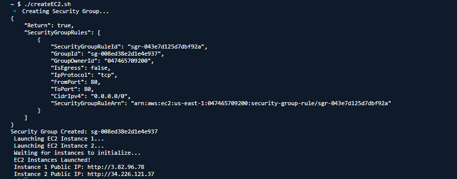
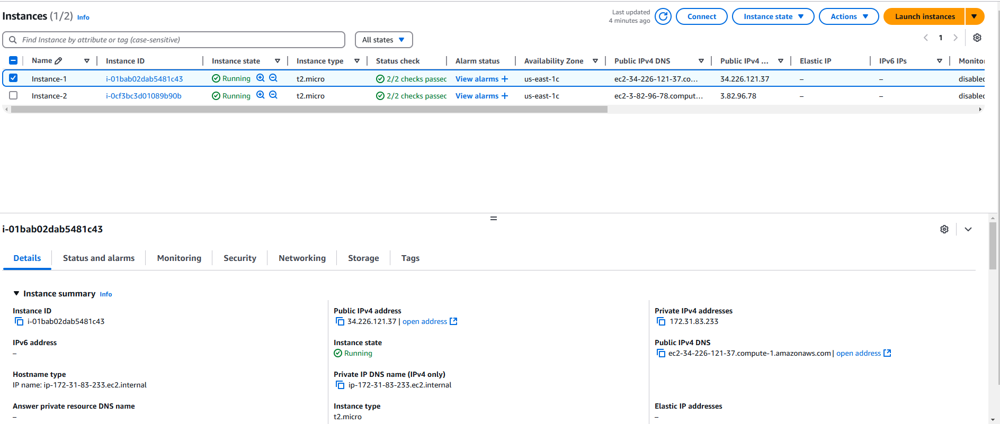
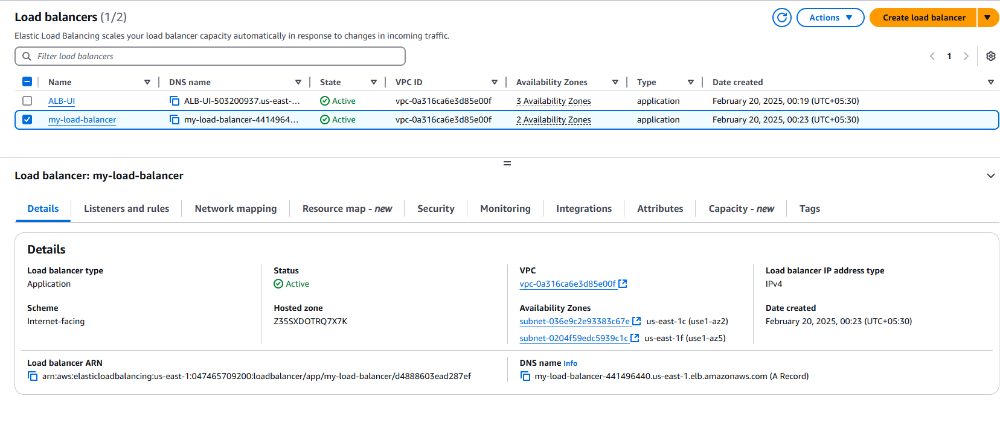
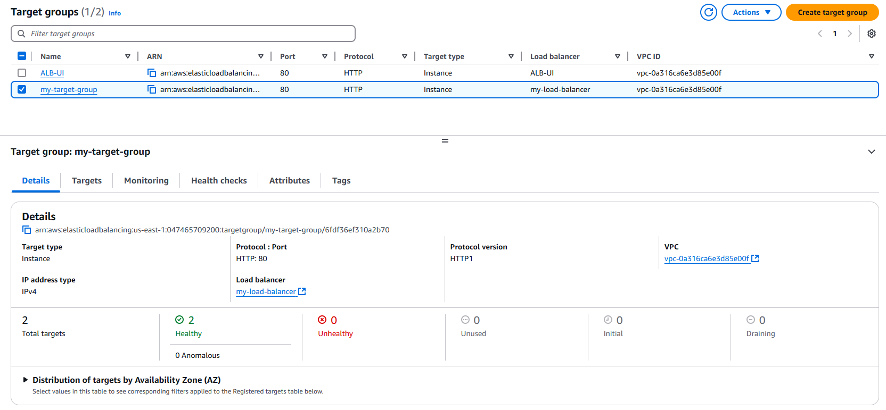

# **Creating EC2 Instances**

---

## **Step 1: Open AWS Shell**

1. Open the AWS Shell.
2. Create a shell script file using the following command:
   ```sh
   nano createEC2.sh
   ```
3. Provide executable permissions to the file:
   ```sh
   chmod +x createEC2.sh
   ```
4. Paste the code from the folder *Create-EC2*.

---

## **Step 2: Execution and Output**

### **Shell Script Output**


### **EC2 Instances Landing Page Post Creation**


### **EC2 Instances Providing NGINX Web App**


---

# **Creating Target Groups and ALB**

---

## **Step 1: Open AWS Shell**

1. Open the AWS Shell.
2. Create a shell script file using the following command:
   ```sh
   nano createALB.sh
   ```
3. Provide executable permissions to the file:
   ```sh
   chmod +x createALB.sh
   ```
4. Paste the code from the folder *Create-EC2*.

---

## **Step 2: Execution and Output**

### **Application Load Balancer Landing Page Post Creation**


### **Target Groups Landing Page Post Creation**


### **ALB Redirecting to Instance 1**


### **ALB Redirecting to Instance 2**


---

## **Summary**

- Successfully created EC2 instances running NGINX web applications.
- Configured Application Load Balancer and Target Groups.
- Verified ALB correctly redirects traffic to different EC2 instances.
- Screenshots provided as verification of implementation.
