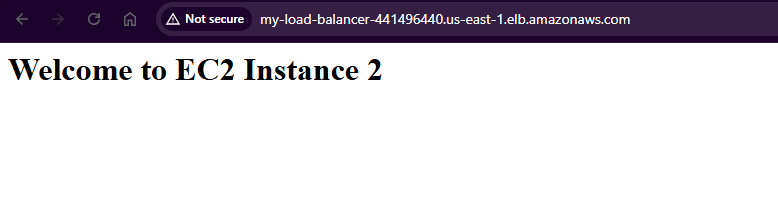

  

# Creating-EC2-Instances

  

1. Open Up AWS Shell

2. Create a shell file Using the Following Command

3. Excecute the following command `nano createEC2.sh`

4. Provide Executable Permissions to the file `chmod +x create-ec2.sh`

5. Paste the code from Folder *Create-EC2*

6. Output
**Shell Script Output**

**EC2 Instances Landing Page Post Creation**

**EC2 Instances Providing NGINX Web App**

  

# Creating-TargetGroups and ALB

  

1. Open Up AWS Shell

2. Create a shell file Using the Following Command

3. Excecute the following command `nano createALB.sh`

4. Provide Executable Permissions to the file `chmod +x create-ec2.sh`

5. Paste the code from Folder *Create-EC2*

6. Output
**Application Load Balancer Landing Page Post Creation**

**Target Groups Landing Page Post Creation**

**ALB Redirecting To Instance-1**

**ALB Redirecting To Instance-2**
